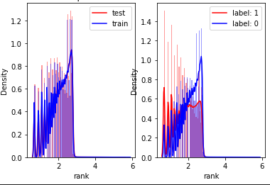

# SOHU2022 情感分析 × 推荐排序 算法大赛 RANK 5
基于树模型的解决方案，从以下三方面来处理特征
## rank特征
label的分布和pvid内的顺序相关  
  
> 一行代码分析分布平衡：`plot_cat_by(train,test,cols='rank',label='label')`

主要是通过构造相关的特征上分，包括：
- pvid,pvid itemid等对logts的rank
- 统计rank的max,min,std,max-min,norm等

## 曝光特征
当日曝光，历史曝光，全局曝光等

## 序列特征
- word2vec 对历史序列进行word2vec，对embedding做统计max,min,sum,mean,std
- target attention 当前item的embedding对历史序列item的embedding做corr，然后对corr做统计max,min,sum,mean,std

## 情感特征
- 直接map到当前item对概率进行统计
- map到历史item，对概率做双重统计😂

## 实体特征
- tfidf-svd

# 建模
catboost利用五折做融合，单模cv**708** lb**705**

# 复现
```python
pip install lianyhaii
## 下载数据放到Sohu2022_data
python train.py
```